> **哈尔滨工业大学**
>
> **硕士学位论文开题报告**
>
> **题 目：无人机数据驱动建模与轨迹跟踪及**
>
> **避障控制研究**
>
> **院 （系） [航天学院]{.underline}**
>
> **学 科 [机械]{.underline}**
>
> **导 师 [齐乃明]{.underline}**
>
> **研 究 生 [王旭]{.underline}**
>
> **学 号 [20S118174]{.underline}**
>
> **开题报告日期 [2021.9.11]{.underline}**
>
> **研究生院制**

# 目录 {#目录 .TOC-Heading}

[1. 课题来源及研究的背景和意义 [3](#_Toc82042710)](#_Toc82042710)

> [1.1. 课题来源 [3](#_Toc82042711)](#_Toc82042711)
>
> [1.2 课题研究的背景和意义 [3](#_Toc82042712)](#_Toc82042712)

[2. 国内外在改方向的研究现状及分析 [4](#_Toc82042713)](#_Toc82042713)

> [2.1 四旋翼飞行器发展概况 [4](#_Toc82042714)](#_Toc82042714)
>
> [2.2 四旋翼无人机动力学建模研究现状 [6](#_Toc82042715)](#_Toc82042715)
>
> [2.3 四旋翼无人机控制方法研究现状 [7](#_Toc82042716)](#_Toc82042716)
>
> [2.3 国内外文献综述的简析 [9](#_Toc82042717)](#_Toc82042717)
>
> [2.3.1 四旋翼动力学建模问题 [9](#_Toc82042718)](#_Toc82042718)
>
> [2.3.2 四旋翼姿态控制问题 [9](#_Toc82042719)](#_Toc82042719)

[3. 主要研究内容 [9](#_Toc82042720)](#_Toc82042720)

> [3.1 哈密顿力学的四旋翼动力学模型 [11](#_Toc82042721)](#_Toc82042721)
>
> [3.2 微分神经网络对动力学进行预测 [11](#_Toc82042722)](#_Toc82042722)
>
> [3.3 基于模型预测控制的轨迹跟踪 [11](#_Toc82042723)](#_Toc82042723)
>
> [3.4 附加控制器进行安全性约束 [12](#_Toc82042724)](#_Toc82042724)

[4. 已完成的研究工作 [12](#_Toc82042725)](#_Toc82042725)

> [4.1 国内外相关领域调研 [12](#_Toc82042726)](#_Toc82042726)
>
> [4.2 神经网络动力学长期预测 [12](#_Toc82042727)](#_Toc82042727)
>
> [4.3 哈密顿力学理论基础 [14](#_Toc82042728)](#_Toc82042728)
>
> [4.4 微分神经网络动力学预测 [15](#_Toc82042729)](#_Toc82042729)
>
> [4.5 模型预测控制 [15](#_Toc82042730)](#_Toc82042730)

[5. 研究方案及进度安排 [15](#_Toc82042731)](#_Toc82042731)

> [5.1. 研究方案 [15](#_Toc82042732)](#_Toc82042732)
>
> [5.2 预期达到的目标和取得的研究成果 [15](#_Toc82042733)](#_Toc82042733)
>
> [5.3 进度安排 [15](#_Toc82042734)](#_Toc82042734)

[6. 为完成课题已具备和所需的条件和经费 [15](#_Toc82042735)](#_Toc82042735)

[7. 预计研究过程中可能遇到的困难和问题，以及解决的措施 [15](#_Toc82042736)](#_Toc82042736)

[8. 主要参考文献 [15](#_Toc82042737)](#_Toc82042737)

# 1. 课题来源及研究的背景和意义 {#_Toc82042710}

## 1.1. 课题来源 {#_Toc82042711}

## 1.2 课题研究的背景和意义 {#_Toc82042712}

无人机（Unmanned Aerial Vehicles，UAV）是可远程操控并携带有效载荷的飞行器，具有使用便捷、成本低廉的特点，被广泛应用于军用及民用领域。近些年随着电子技术和控制技术的发展，无人机的受到越来越广泛的关注，新的无人机应用呈爆炸式增长。无人机的最初目的是军事侦察、情报、监视和目标捕获（Reconnaissance Intelligence Surveillance, and Target Acquisition，RISTA）应用^[\[1\]](#_Ref81864860)[\[2\]](#_Ref81864871)^。目前也已广泛应用于民用领域，包括即时灾难响应、教育、环境和气候研究、旅游、测绘、作物评估、天气、交通监控和许多其他方面^\[3\]^。

四旋翼无人机由于其高集成、低损耗、易于控制、可垂直起降、快速灵活等诸多优势而收到越来越广泛的关注[^\[4\]^](#_Ref81864939)、成为部分军用和民用领域的首选平台。在军用领域，四旋翼无人机可以通过高速信息扫描、低空悬停等方式执行全天候信息侦察和战场态势感知；可携带作战单元进行实现精准打击；可针对微波信号、指挥网络、激光制导实施信息对抗；可在信息化战争中建立备份通信链路。在民用领域，四旋翼应用更加广泛，包括航空摄影、农业喷洒灌溉、线路巡检补修、环境监测等。特别在近期的新冠疫情防控中，四旋翼进一步发挥其独特优势，在人车引导、群体测温、人群疏散、杀毒消菌及空地宣传等方面发挥了重要作用，更加凸显四旋翼无人机技术发展的必要性与紧迫性。

无人机适应于在复杂恶略的情况下工作，尤其是具有垂直起降和悬停功能的四旋翼无人机，可以完成对复杂环境的探测等任务^[\[5\]](#_Ref81940474)-[\[7\]](#_Ref81940476)^。通常无人机操作需要通过通讯链路获取当前状态并发送控制指令，然而通讯系统的延迟、带宽限制及意外磁场干扰都将影响无人机的飞行。因此对其稳定和自主控制提出了更高的要求。

但随着无人机越来越广泛应用于各行业，其安全问题也逐渐凸显，多旋翼无人机伤人事件也频频爆出。多旋翼无人机叶片运转时转速可达到150转/秒，若碰到路人会产生严重的人体伤害，碰到障碍也会对无人机造成损伤。当前提出的一些举措如在叶片上装保护罩，限制飞行区域等能够起到一定作用，但无法根本解决问题且一定程度限制其灵活性。因此多旋翼无人机在复杂环境中循迹同时安全避障及自主绕开行人进而安全到达目标点也现得尤为重要。

本文以近期人工智能领域数据驱动建模及强化学习控制的研究成功为基础，对四旋翼轨迹跟踪及安全避障进行研究和分析。针对四旋翼无人机的自主路径规划及安全鲁棒控制问题，国内外学者对相应飞行控制算法进行了深入的研究，提多了诸多控制策略，取得了显著进步。但在实际控制应用中，仍存在以下难题[^\[8\]^](#_Ref81865139)：

1）难以建立精确动力学模型。四旋翼飞行器本身存在结构误差，臂长、质量分布并不完全一致，且结构容易发生形变。其次还需要考虑不同飞行状态下旋翼的空气动力学特性及气流变化等外部干扰因素的影响。

2）控制较为复杂。四旋翼飞行器是个非线性、强耦合、欠驱动、时变被控对象。是四输入六输出的欠驱动系统，输出量之间有强耦合性。因此设计飞行控制系统，必须考虑其本身的非线性和强耦合性，控制系统需要较好的解耦性及鲁棒性。

3）易受干扰。四旋翼尺寸小，易受电机高速旋转的震动影响。在空中飞行容易受气流变化等外界扰动的影响，且大部分旋翼材质为柔性，在阵风作用下会发生形变改变原有气动特性。因此控制系统设计需要充分考虑外界干扰，深入分析飞行力学特性，提高其控制的鲁棒性和安全性。

针对以上问题，本文提出基于数据驱动的微分神经网络建模方法，建立基于模型强化学习的控制框架，并针对路径障碍设计具有安全性和鲁棒性的附加控制器，完成四旋翼复杂环境下的稳定轨迹跟踪和安全避障任务。

# 2. 国内外在改方向的研究现状及分析 {#_Toc82042713}

## 2.1 四旋翼飞行器发展概况 {#_Toc82042714}

四旋翼从上世纪20年代开始发展，第一架四旋翼由Louis Breguent设计并命名为Breguet-Richet，是第一个利用螺旋桨提供升力的飞行器，虽然试飞效果并不理想，离地0.6米，留空1分钟，但这标志着多旋翼无人机研究正式拉开序幕。1920年法国人Etienne Ochmichen设计了一种一个发动机带动四个旋翼的的动力结构，另外安装8个螺旋桨用于飞行控制，命名为Oechmichen No.2。1922年george de Bothezat研制了一款"X"型布局的四旋翼飞行器---Flying Octopus。1924年法国工程师设计出第一台可以实现1千米垂直飞行，留空14分钟的四旋翼无人机，在当时创下多项纪录。

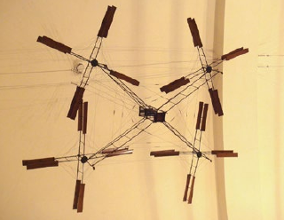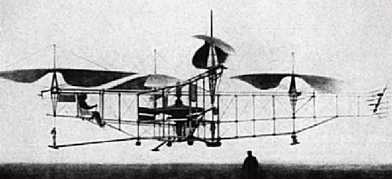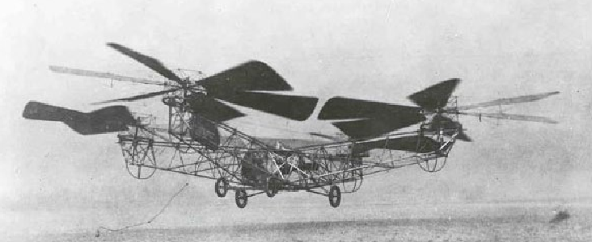

\(a\) Breguet-Richet (b) Oechmichen No.2 (c) Flying Octopus

图 1 上世纪20年代三种四旋翼飞行器

Convertawings企业1956年设计出一架通过两个发电机改变螺旋桨推力从而控制飞行到多旋翼无人机。1957年Curtiss-Wright公司为美国军方研制了了一款垂直起降飞行器，命名为VZ-7AP，其包含四个旋翼，并通过调整旋翼转速控制飞行稳定。此时的四旋翼飞行器已经和现在使用的四旋翼无人机具有相同的动力结构和控制方式。这一阶段四旋翼设计主要在于克服旋翼升力可调的问题，其飞行控制依赖于额外设备和飞行员大量操作，且受限于控制器和传感器的发展，因此未能得到广泛应用。

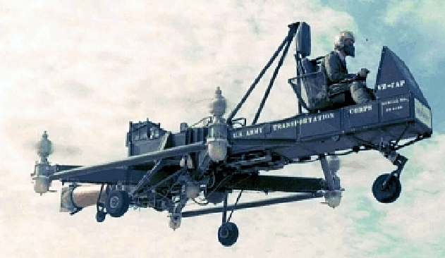

跨入本世纪，随着微电子技术和控制理论的发展和制造业的蓬勃发展多旋翼无人机研发进程日益加速,国内外许多厂商掀起了多旋翼无人机发展的热潮[\[9\]](#_Ref81866582)。

2006德国Microdrones公司推出MD-100四旋翼无人机，首次应用电机驱动四旋翼并实现稳定控制飞行，如图所示。MD4系列无人机引入姿态、高度及航向控制，并集成磁力计、加速度计、陀螺仪等多种惯导元件和优秀控制算法，实现小型四旋翼的稳定控制。可以手动操控和自动巡航飞行，是当时全球领先的四旋翼飞行器。

2010年法国Parrot公司推出AR.Drone，开启消费级多旋翼无人机时代。其支持多点触控计重力感应，可由手机或平板直接控制。AR.Drone配置了多个捕获器、前置摄像头、各种惯导元件和超声波传感器等，可实现断联情况下自动驾驶与平稳降落，充分体现其作为消费级产品的安全性和实用性。

2015年，美国3D Robotics推出第一款智能无人机Solo，该无人机内置两个高频Linux计算机，支持自动飞行、环绕拍摄等功能。因其操作简单扩展接口丰富，具有较高灵活性，一经问世便收到广泛关注。2019年，Amazon发布新版送货无人机Prime Air。它集成热成像仪、深度相机和各种测距传感器，能够领域机器学习自动识别障碍并到达目的地，并且极大解决了无人机噪音问题。可以以旋翼模式垂直起降，起飞后四轴收回，切换为固定翼飞行。这种混合结构模式结合了旋翼机垂直起降和固定翼飞行速度快的优点，为以后无人机发展提供了新思路。

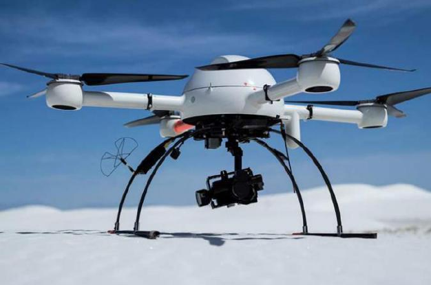 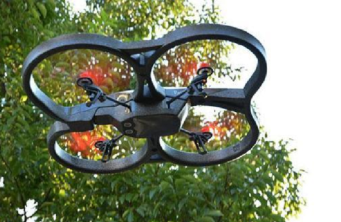

\(a\) 德国 MD4-1000 (b) 法国 AR.Drone

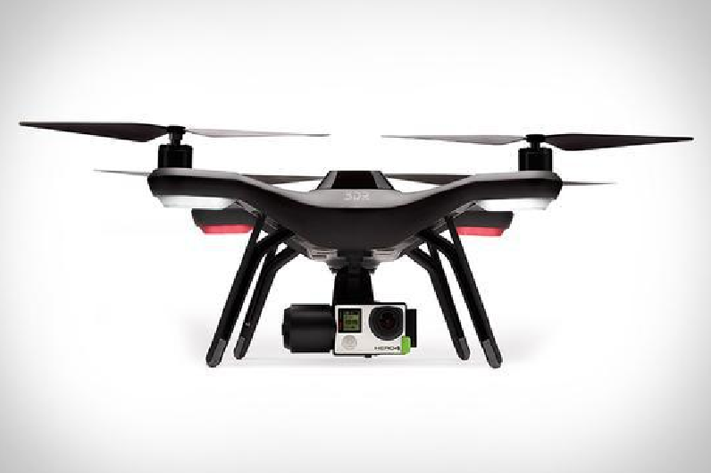 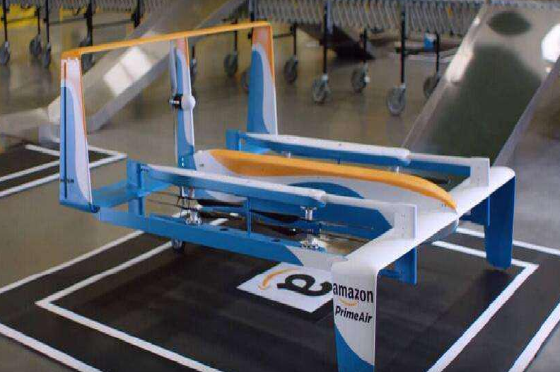

\(c\) 美国 Solo (d) 美国Prime Air

图 3 国外四旋翼无人机

国内四旋翼无人机产业发展起步较晚，但由于发展迅速，中国已经成为消费无人机的主要创造国，涌现一批以深圳大疆、北京零度、广州极飞等为代表的顶尖无人机厂商。大疆于2016年发布Phantom 4，具有障碍物感知、定点飞行和智能跟随等模式，将人工智能结合到无人机控制中。而且搭载6个视觉传感器、1组超声波、2组红外传感器以及GPS模块，可在飞行过程中获取实时图像，实现三维地图重建与定位。

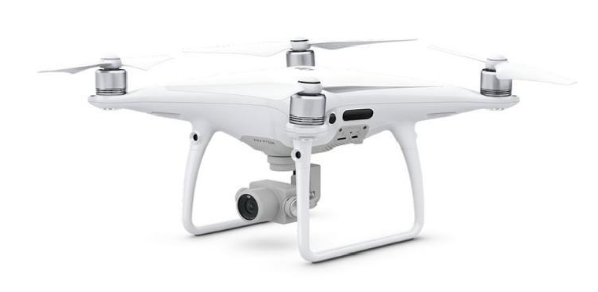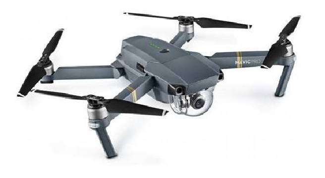

\(a\) 大疆 Phantom 4 Pro (b) 大疆 Mavic 2 Pro

图 4 大疆四旋翼

在四旋翼发展历程中，外国厂商曾居于领先地位，但中国企业发展迅速，占据了全球无人机市场份额半壁江山，例如大疆已成为四旋翼无人机领域龙头企业。但无人机在自主飞行和避障技术领域仍有较大发展空间，我国无人机发展仍任重道远。

## 2.2 四旋翼无人机动力学建模研究现状 {#_Toc82042715}

四旋翼无人机是一个非线性、多变量、高耦合度的欠驱动系统。在飞行过程中，四旋翼无人机不但同时受到空气动力、重力和陀螺效应等多种物理效应的作用，还容易受到气流等外部环境的干扰，很难获得准确的气动参数，因此难以建立有效、准确的动力学模型。

针对四旋翼的建模方法目前已有较多研究，很多研究机构都采用简化的四旋翼动力学模型，通过理论分析计算四旋翼无人机动力学特性，简化或增加四旋翼约束条件，建立线性或非线性模型，但质量参数等的误差和未完全建模的气动效应仍会造成较大影响，降低模型精确度^[\[10\]](#_Ref82035539)-[\[12\]](#_Ref82035542)^。也有一些研究机构针对某四旋翼建立了全动力学模型。克兰菲尔德大学[^\[11\]^](#_Ref82035551)针对四旋翼详细描述了物理特性，并做了风洞试验，在Matlab中搭建了全动力模拟器，用于研究四旋翼飞行力学和进行控制算法测试。Vijar Kumar等人选取推力模型和诱导阻力模型进行简化分析，并通过实验方法辨识出空气动力扰动模型参数，在控制器中引入空气动力步长，显著提高了无人机的轨迹跟踪精度^[\[13\]](#_Ref82084389)[\[14\]](#_Ref82084392)^。ETH的Davide等人在理论上证明了引入诱导阻力的四旋翼无人机系统仍未微分平坦系统，因此可使用微分平坦的运动规划算法，并通过实验证明在考虑气动影响后，无人机对轨迹跟踪精度明显提高[^\[15\]^](#_Ref82084397)。

为了应对传统建模方法难以处理的复杂空气动力学扰动及各种效应，基于机器学习的神经网络黑盒模型具有独特的优势，可以通过数据交互不断学习无人机系统动力学特性，并实时在线更新，便于建立高可靠的精确动力学模型。文献[\[16\]](#_Ref82085385)利用神经网络建立单步动力学模型并结合模仿学习完成系统控制。文献[\[17\]](#_Ref82085297)采用变步长网络对系统进行预测。文献[\[18\]](#_Ref82085309)提出了概率网络，并应用于各种机器人系统，取得较好的效果。但基于深度神经网络的无人机建模仍存在三个较大难点：

1）难以收集足够的数据集，神经网络需要大量数据集进行训练；

2）神经网络对高维状态预测不稳定，会出现不可靠的输出结果，导致控制系统不稳定；

3）神经网络可解释较差，难以分析和从理论上保障稳定性和鲁棒性。

针对以上问题，目前一些学者进行了针对性研究。文献^[\[19\]](#_Ref82085313)[\[20\]](#_Ref81918373)^运用神经网络提高对旋翼系统动力学辨识能力，但未进行控制器设计。也有一些学着以神经网络生产参考输入或参考轨迹^[\[21\]](#_Ref81918449)-[\[24\]](#_Ref81918462)^。然而这些方法最大的难点在于优化问题[^\[21\]^](#_Ref81918449)，或比较依赖于较好的闭环控制器设计和大量的标签数据集^[\[22\]](#_Ref81918496)-[\[24\]](#_Ref81918462)^。一些经典的方法直接使用神经网络设计逆动力学控制器^[\[25\]](#_Ref81918509)-[\[27\]](#_Ref81918510)^，但神经网络的非参数特性使得控制器难以保证稳定性和鲁棒性。文献[^\[28\]^](#_Ref81918583)提出李亚普诺夫稳定性保障的基于模型强化学习算法，但需要大量学习离散时间步数据且依赖于深度网络的本征李普斯基常数。

## 2.3 四旋翼无人机控制方法研究现状 {#_Toc82042716}

四旋翼无人机是一个非线性、欠驱动的被控对象，其飞行控制具有四个难点问题：建模困难、欠驱动、强耦合、易受外界干扰。因此虽然由很多研究已经提出了小型四旋翼飞行控制系统，其控制算法的研究仍然是一个研究热点。

针对四旋翼的控制问题，国内外学者或简化模型，忽略不确定性影响，将系统化为线性模型进行控制，如经典PID控制，LQR及H无穷控制；或对非线性，鲁棒性算法展开研究，提高控制系统抗干扰及环境适应能力，如反步法、反馈线性化及滑膜控制；或采用智能算法，降低对系统建模精度的需求，利用神经网络等设计控制器使四旋翼随着训练自行适应和完成复杂任务。四旋翼的研究控制方法主要如图所示。

PID控制是最广泛应用的控制方法，其实现简单，参数易调整，且可以实现较为稳定可靠的控制性能，因此广泛应用于商业四旋翼中。文献[\[30\]](#_Ref81865400)从频域的角度分析选取合适的PID参数，以达到最优的PID控制效果。文献[\[31\]](#_Ref81865417)则将PID参数视为变量，设计了模糊控制器，针对不同的飞行状态来选择合适的PID参数值。PID可以实现稳定的位置控制，但忽略了系统的非线性，系统鲁棒性不够理想，因此解耦能力和抗干扰能力不足，且整定PID参数复杂繁琐，限制了其控制能力的提高。

线性二次调节器（Linear Quadratic Regulator，LQR）控制是基于线性模型的控制方法，其被控对象是由状态空间方程构建的线性系统，优化的目标函数为状态与控制量的二次型函数积分，控制率与状态参数呈现线性关系。文献[\[32\]](#_Ref81865431)[\[33\]](#_Ref81865433)基于LQR实现了四旋翼的稳定控制。LQR控制可以实现闭环最优控制，且方法简单便于实现，但在线性化模型过程中会丢失模型非线性特性，降低控制系统鲁棒性，且适用范围小，仅能实现工作点附近的最优控制。

H∞控制利用特定传递函数H∞范数表述系统性能指标，克服了系统不确定性，因此适用于四旋翼这种存在不确定扰动，模型动态不稳的非线性系统。文献[\[34\]](#_Ref81865447)以H无穷做姿态控制，结合模型预测控制来提高无人机在各种复杂约束的对抗环境中的控制性能。文献[\[35\]](#_Ref81865460)结合H∞和线性反馈控制在质量、惯性未知及控制量饱和的情况下取得了良好的控制效果。但H∞控制求解过程复杂，较难实现，且也是基于线性模型构建，适用范围有限。

反馈线性化控制基于系统状态反馈，获取系统输入输出关系，将系统转化为线性系统进行控制。文献[\[36\]](#_Ref81865503)基于局部线性化四旋翼模型，设计反馈线性化控制器实现稳定轨迹跟踪。相较于线性控制，其优势在于不受工作点的束缚，但由于依赖精确的系统模型，其鲁棒性和抗干扰性较弱。

反步法是将非线性系统分解成多个子系统，构造李亚普诺夫函数选取虚拟中间量，最后退回总系统实现非线性控制。其适用于具有严格反馈控制结构的系统，具有良好的无超调跟踪性能。文献[\[37\]](#_Ref81865586)将四旋翼拆解为高度、俯仰、滚转及偏航四个子系统，采用反步法实现稳定轨迹控制。但反步法依赖于系统模型的先验信息，因此模型误差对控制精度影响较大。

滑膜控制通过改变系统内部反馈控制结构，使系统状态在滑模面上渐进稳定。文献[\[38\]](#_Ref81865598)提出忽略模型的滑模控制，以稳定四旋翼轨迹跟踪性能。与反馈线性控制相比其不依赖于精确模型，有效规避了环境干扰，具有较好的鲁棒性，但存在着伴生抖动现象。

智能控制方法包括模型预测控制，模糊逻辑控制，神经网络控制等。运用神经网络等智能方法对系统进行补偿控制，如基于反馈误差的神经网络的训练补偿控制[^\[39\]^](#_Ref81865611)，或设定模糊规则的模糊逻辑控制及运用模型预测进行复杂多约束环境下的鲁棒控制[^\[40\]^](#_Ref81865622)，具有较好的控制效果和较大的发展前景。

## 2.3 国内外文献综述的简析 {#_Toc82042717}

四旋翼无人机的稳定路径跟踪及鲁棒控制依旧是研究难点，尤其考虑到避障时的安全控制，因此在上面对相关领域研究现状调研的基础上，本节针对一下主要问题的发展进行分析。

### 2.3.1 四旋翼动力学建模问题 {#_Toc82042718}

四旋翼是一种强非线性和高耦合性的动力学系统，因此难以建立精确动力学模型。考虑叶片旋转的空气动力学复杂，机体几何及动力学参数测量偏差，其动力学模型很难精确建立。且受到外部阵风干扰等不确定干扰，其运动状态也会与理论模型出现较大偏差，为后续控制带来较大困难。目前四旋翼无人机的数学模型都是基于若干假设下的简化模型，因此所用的基于模型的控制算法容易受到模型精度的影响。国内外学者也对其数学模型展开了深入研究，旨在进一步完善数学模型。目前神经网络等人工智能方法都逐渐应用在四旋翼无人机建模上，取得一定的成果，但神经网络的可解释和理论分析保证仍是一个较大难点，且建模的鲁棒性和稳定性难以保障，尤其缺少对四旋翼进行长期精确动力学预测的方法。

### 2.3.2 四旋翼姿态控制问题 {#_Toc82042719}

由于四旋翼结构简单且执行机构具有非冗余、低可靠性的特点，易受到各种内部扰动如机身震动或外部如阵风的影响。因此其稳定位姿控制主要问题在于在线扰动抑制。但现有的研究如PID、H∞等都依赖于精确动力学模型，在模型有较大误差时控制效果较差。而目前兴起的人工智能方法在数据驱动的高维复杂动力学预测上具有极好的应用前景，基于此建立的精确动力学模型结合模型预测控制等方法，有望大幅提高无人机的自主控制性能。

# 3. 主要研究内容 {#_Toc82042720}

本文针对四旋翼在复杂扰动、模型未知的情况下进行轨迹跟踪和避障研究，如[图 6](#_Ref81765355)所示。即在跟踪轨迹上存在障碍时，自主安全避开障碍同时尽量靠近期望轨迹。

![[]{#_Ref81765355 .anchor}图 6 四旋翼轨迹跟踪及避障环境](硕士开题报告-王旭_media/media/image12.png)

针对已有算法提出基于模型的强化学习算法框架，实现四旋翼复杂环境的精确鲁棒控制。如[图 7](#_Ref81765397)所示。

![[]{#_Ref81765397 .anchor}图 7 算法框架](硕士开题报告-王旭_media/media/image13.emf)

首先使用数据驱动方法进行动力学建模，在质量参数及扰动不确定情况下，先初步运用哈密顿力学对四旋翼进行初步建模，再通过数据交互获取数据集，采用微分神经网络预测哈密顿算子，对系统进行具有物理约束的动力学建模。基于建立的数据驱动黑箱模型，采用模型预测控制进行路径跟踪的控制，考虑其避障任务，设计附加控制器确保飞行安全。

## 3.1 哈密顿力学的四旋翼动力学模型 {#_Toc82042721}

现有神经网络或高斯过程等数据驱动动力学建模无稳定性保障，因此考虑以哈密顿力学建立系统方程，再利用神经网络建立机理导向的数据驱动模型，实现高数据利用率和具有稳定性保障的精确动力学建模方法。

哈密顿力学将系统广义变量和动量项视为自变量，以拉格朗日算子进行勒让德变换，得到代表系统总能量的哈密顿算子。通过神经网络分别拟合哈密顿算子的各项，得到数据驱动的哈密顿动力学模型。哈密顿动力学结合神经网络使神经网络具有一定的数学可解释性，而不仅是简单黑箱模拟，使神经网络天然满足一些动力学约束如能量守恒、角动量守恒等，在复杂动力学系统建模和长期稳定预测中具有较大优势。

## 3.2 微分神经网络对动力学进行预测 {#_Toc82042722}

通过微分神经网络对系统进行动力学建模，微分神经网络基于数值微分方程求解的思路，通过网络输出表示为系统的微分算子，再结合龙科库塔等数值微分方程求解方法得到任意期望时间的状态。通过这种思路使得网络并不再是简单拟合固定步的状态预测，而是将，通过使网络可以进行平滑性的任意时间步状态预测。考虑网络更新时梯度在微分方程求解器中的反向传播问题，引入伴随灵敏度法重新推导梯度下降公式，进行网络参数更新。

微分神经网络的思想使得神经网络不再试简单的状态拟合，而是从数值求解微风方程的角度对系统进行预测，提高了预测的鲁棒性和泛化性。

## 3.3 基于模型预测控制的轨迹跟踪 {#_Toc82042723}

基于上述建立的系统动力学模型，采用模型预测控制对四旋翼进行控制，通过设定合理损失函数实现四旋翼避障和路径跟踪功能。模型预测控制求解使用无梯度（gradient free）的求解方式，即常用的交叉熵算法（Cross Entropy Method，CEM），通过长期预测筛选出最优控制序列并采取第一个控制量对系统进行控制，得到反馈状态后持续以上步骤，通过这种滚动优化思路使四旋翼得到近似全局最优的控制序列。

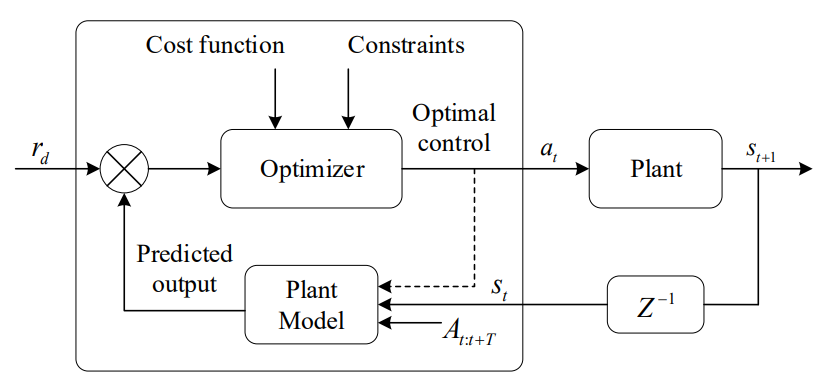

## 3.4 附加控制器进行安全性约束 {#_Toc82042724}

基于机器学习如神经网络建立的模型并通过模型预测控制设计控制器时，通常将环境约束等编码到代价函数中，通过调整权重实现稳定控制。但其安全性难以保证，且在系统受到扰动时容易陷入高代价区域，造成安全风险。

考虑到四旋翼控制安全性和鲁棒性，在模型预测控制量基础上设计附加控制器对控制量进行修正，确保四旋翼在复杂环境的飞行安全性。附加控制器仿照李亚普诺夫控制函数（Control Lyapunov Function，CLF），设定全局域的李函数，设定控制器满足李函数在控制中单调下降的约束，以二次规划求解控制量。考虑避障环境，在势力场中引入路径规划中常见的障碍，就得添加更多约束，因此引入屏障控制函数（Control Barrier Function，CBF），通过定义障碍区域的李函数，对控制器求解添加障碍约束，使用二次规划求解使得控制量同时满足全局域李函数势能下降且不进入障碍区域，保证控制器的安全性。

# 4. 已完成的研究工作 {#_Toc82042725}

## 4.1 国内外相关领域调研 {#_Toc82042726}

针对四旋翼无人机轨迹跟踪与避障任务，完成了国内外最新研究进展的调研。包括四旋翼发展的历史及当前的研究现状、四旋翼无人机动力学建模的困难和前景、四旋翼位姿控制主流方法等方面的研究进展。

1)调研了四旋翼发展历史，了解了四旋翼的发展历程及前景。

2)调研了四旋翼动力学建模的主要方法，以及神经网络在动力学建模的应用，了解了神经网络四旋翼动力学建模研究现状。

3)调研了四旋翼主流位姿控制方法，了解了各种控制方法的优缺点以及后续的发展方向。

## 4.2 神经网络动力学长期预测 {#_Toc82042727}

数据驱动方法对系统进行建模时，主要有两大类误差：偶然误差，采集数据集时因传感器噪声引入的误差；推断误差，数据集有限导致数据集较少的区域拟合性较差，如图所示。尤其在长期动力学预测，这两种误差随时间迭代累计会造成模型预测发散，无法对系统进行稳定控制。

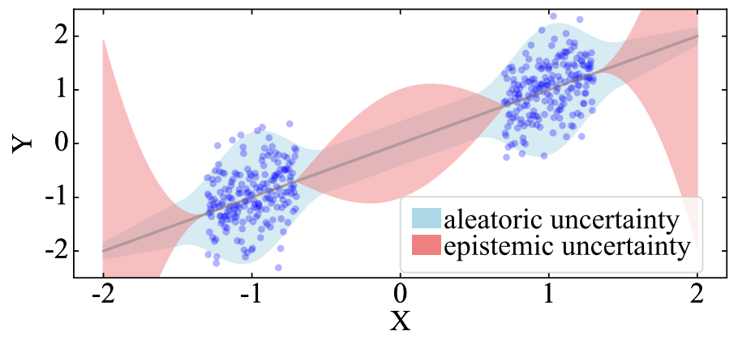

针对动力学系统长期预测的问题，进行了多模型概率网络的研究。构建神经网络使网络输出预测状态的均值与方差，并以最大似然函数作为代价函数进行梯度更新，解决数据集中存在的高斯噪声，降低偶然误差对动力学拟合的影响。采用并行多个概率网络独立训练，将各网络输出重采样作为实际预测输出，解决在数据集稀疏区域的推断性误差。结合上述方法实现了对动力学系统长期稳定预测，算法架构如[图 10](#_Ref81940021)所示。

![[]{#_Ref81940021 .anchor}图 10 多模型概率网络架构](硕士开题报告-王旭_media/media/image16.png)

基于上述所提方法在空间机械臂上进行了仿真验证，证明其在复杂动力学系统的长周期预测任务的良好表现，结果如图。

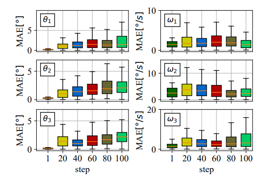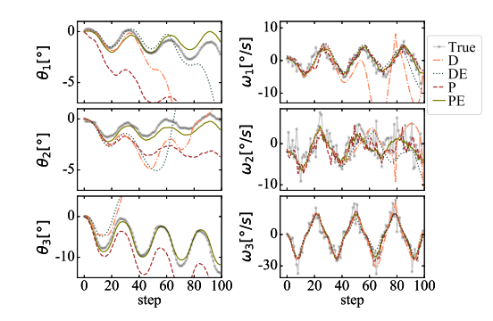

图 11 多模型概率网络对于空间机械臂系统动力学预测效果

## 4.3 哈密顿力学理论基础 {#_Toc82042728}

哈密顿力学定义哈密顿算子，为广义变量和动量的函数，其含义近似系统总能量，因此可以表示为

  ---------------------------------------------------------------------------------------------
                           （1）
  --------------------- ------------------------------------------------ ----------------------

  ---------------------------------------------------------------------------------------------

其中质量阵为正定对偶阵，为系统势能项。系统的时间转换微分方程表示为

  ------------------------------------------------------------------------------------------------------------------------------------------------
                          ，   （2）
  ----------------------- ------------------------------------------------------------------------------------------------ -----------------------

  ------------------------------------------------------------------------------------------------------------------------------------------------

其中u为系统控制量输入。波特-哈密顿算子作为哈密顿系统的推广，考虑了系统能量守恒（动能和势能）、能量耗散（摩擦或电阻等）和外界能量输入（控制量等），将系统表示为

  --------------------------------------------------------------------------------
                    （3）
  -------------- ------------------------------------------------ ----------------

  --------------------------------------------------------------------------------

其中为反对称矩阵，表示系统储能项；为半正定矩阵，表示系统能量耗散项；为输入矩阵代表外力输入项，即系统控制量。

若不考虑系统中能量耗散，系统内部能量守恒，则有

  ------------------------------------------------------------------------
                     （4）
  ---------- ----------------------------------------------------- -------

  ------------------------------------------------------------------------

因此可以用三个子网络分别拟合广义质量项，系统势能项和输入矩阵，从而通过神经网络完成系统动力学建模，如[图 12](#_Ref81863449)所示。系统微分方程表示为

  ------------------------------------------------------------------------------------------------
                             （5）
  ----------------------- ------------------------------------------------ -----------------------

  ------------------------------------------------------------------------------------------------

其中有为系统观测量，为网络最终拟合的映射方程，为总的网络参数。

![[]{#_Ref81863449 .anchor}图 12 神经网络结合哈密顿力学动力学建模框架](硕士开题报告-王旭_media/media/image35.png)

## 4.4 微分神经网络动力学预测 {#_Toc82042729}

不同于普通网络的离散状态预测，微分神经神经网络通过参数化方程微分项，实现微分方程的连续预测。普通网络如残差网络，循环神经网络对系统建模，通常将系统离散化为固定步长的状态转移函数，如：

  ------------------------------------------------------------------------------------------------
                             （6）
  ----------------------- ------------------------------------------------ -----------------------

  ------------------------------------------------------------------------------------------------

其中为时间，为状态向量，为网络参数。这些网络都是近似一阶欧拉离散的迭代更新方式对动力学系统（微分方程）进行长期预测。而微分神经网络期望对系统进行连续预测，即运用神经网络对常微分方程直接进行预测:

  ------------------------------------------------------------------------------------------------
                             （7）
  ----------------------- ------------------------------------------------ -----------------------

  ------------------------------------------------------------------------------------------------

从给定开始，由系统输出，来训练网络学习其中的连续过程，使得网络更好的拟合微分方程本身，而且可以实现对任意时间点的状态预测，而不仅限于固定步长。微分网络与普通网络区别如[图 13](#_Ref81864089)所示。

![[]{#_Ref81864089 .anchor}图 13 普通网络与微分神经网络](硕士开题报告-王旭_media/media/image43.png)

网络训练时输出为微分量，通过微分方程解算器（ODESolve）如龙哥库塔等得到时刻网络预测状态，将预测值与真值取均方误差作为代价函数传入网络进行训练，更新网络参数。

  ------------------------------------------------------------------------
                    （8）
  ---- ---------------------------------------------------------- --------

  ------------------------------------------------------------------------

考虑网络训练时的梯度在微分解算器中的反向传播问题，使用伴随灵敏度法（adjoint sensitivity）进行梯度计算。这种方法绕过前向传播中的微分解算器，采用增广微分解算器模型计算梯度，可以逼近按路径计算从微分解算器传递回的梯度，适用于所有常微分方程解算器的更新。这种方法在内存和计算复杂度上具有较大优势，同时还能精确控制数值误差。

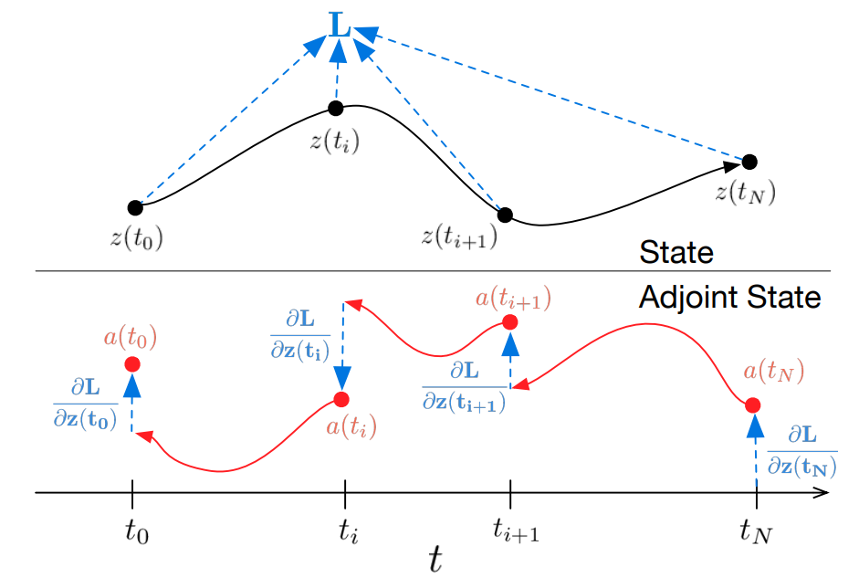

## 4.5 模型预测控制 {#_Toc82042730}

基于上述数据驱动模型，使用模型预测控制对空间机械臂进行期望关节角度和期望末端位置的控制，使用CEM方法进行备选动作序列的优化和更新，算法总体框架如[图 15](#_Ref81939267)所示。

![[]{#_Ref81939267 .anchor}图 15 基于多模型概率网络和MPC机械臂控制算法框架](硕士开题报告-王旭_media/media/image49.png)

使用随机动作序列进行数据集收集，传入多模型概率网络进行训练，模型训练完成后不再与环境进行交互更新。实验证明，多模型概率网络具有良好的泛化性能，配合MPC算法可仅通过较少的数据集完成空间机械臂稳定控制。控制效果如[图 16](#_Ref81939951)所示。

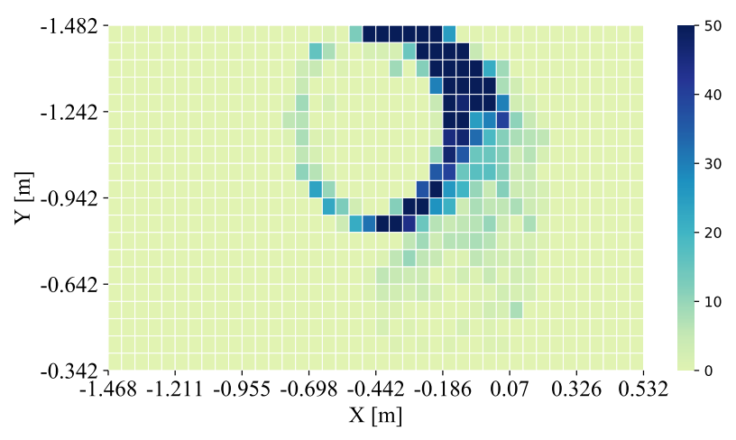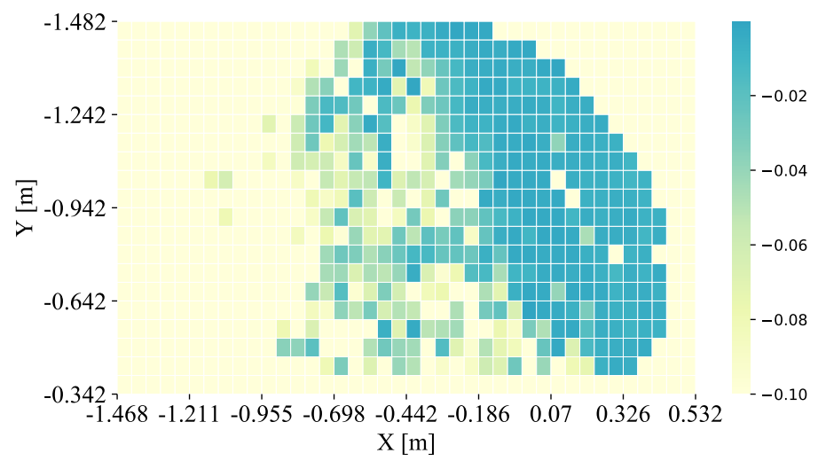

\(a\) 数据集分布 (b) 模型预测精度

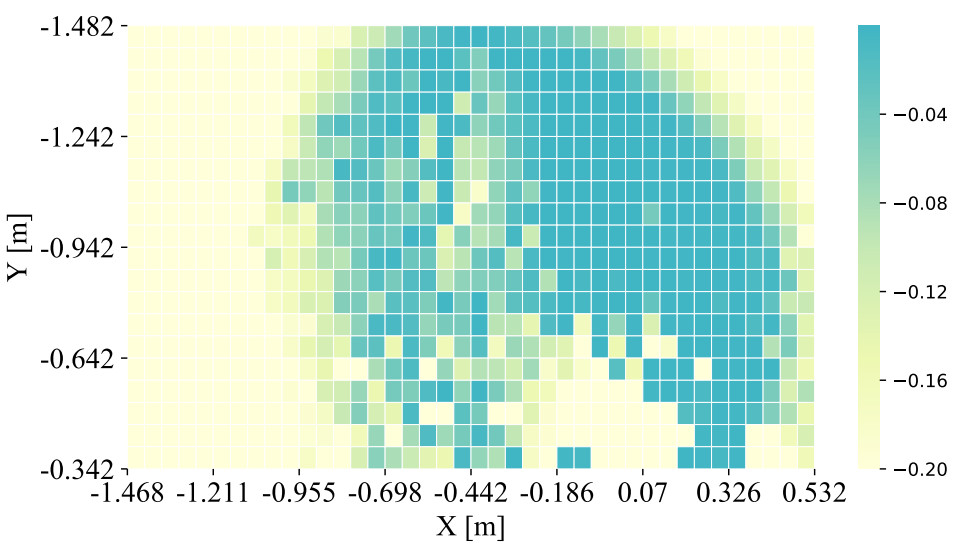

\(c\) 机械臂末端控制精度

[]{#_Ref81939951 .anchor}图 16 基于多模型概率网络的动力学预测和MPC控制效果

# 5. 研究方案及进度安排 {#_Toc82042731}

## 5.1. 研究方案 {#_Toc82042732}

通过对无人机建模和控制器设计，实现无人机在复杂环境下的轨迹跟踪和避障。主要研究方案包括：

1）对无人机动力学进行初步建模，将动力学模型写为哈密顿算子的形式，建立初步数据驱动动力学框架。

2）收集交互数据集训练基于哈密顿力学的神经网络动力学模型，利用其将先验机理信息集成到黑箱神经网络模型中的优势，使动力学模型满足物理规则，如动量守恒，运动学约束等。通过微分神经网络结合满足运动学约束、对偶的哈密顿力学，一定程度上保证了数据驱动模型的可靠性与可解释性，提高模型准确度、鲁棒性及泛化性能。

3）使用模型预测控制对无人机进行控制，实现轨迹跟踪和避障。并设计附加控制器，引入基于李函数的屏障控制函数对任务进行约束，使用二次规划求解控制量，确保无人机在复杂环境下的飞行安全性。

## 5.2 预期达到的目标和取得的研究成果 {#_Toc82042733}

1）建立基于哈密顿动力学的四旋翼无人机动力学和运动学方程，并将系统离散化表示为马尔可夫决策过程，便于后续基于强化学习进行四旋翼控制。

2）建立基于微分神经网络的数据驱动的四旋翼系统动力学模型。

3）结合模型预测控制和交叉熵优化方法实现数据驱动模型下的四旋翼稳定控制

4）利用李亚普诺夫和屏障控制函数建立附加控制器，实现四旋翼在复杂环境下的轨迹跟踪和安全避障。

## 5.3 进度安排 {#_Toc82042734}

2021.9-2021.11 运用哈密顿动力学推导四旋翼动力学及运动学公式.

2021.11-2022.3 结合微分方程网络及四旋翼的哈密顿约束，采用数据驱动方法训练得到四旋翼的动力学预测模型。搭建Vrep下四旋翼仿真模型，获得交互数据对模型进行验证。

2022.3-2022.5 运用模型预测控制及辅助控制器进行四旋翼的控制器设计，并在仿真环境下验证其轨迹跟踪和避障功能。

2022.5-2022.6 总结实验，撰写论文。

# 6. 为完成课题已具备和所需的条件和经费 {#_Toc82042735}

实验所需资料均可通过图书馆和数据库查到，仿真环境搭建也有开源平台，且课题组也有服务器，足以满足研究所需算力，无需额外经费。

# 7. 预计研究过程中可能遇到的困难和问题，以及解决的措施 {#_Toc82042736}

研究过程中可能遇到的问题：

1）对哈密顿动力学不熟悉，基于哈密顿动力学构建四旋翼动力学较为困难。可通过向老师和师兄请教解决。

2）微分神经网络自己编写较为困难。可通过参考网上开源代码进行改写和应用。

3）网络训练需要较大算力。可通过实验室深度学习服务器解决。

# 8. 主要参考文献 {#_Toc82042737}

1.  []{#_Ref81864860 .anchor}D.Glade,"Unmanned aerial vehicles: Implications for military operations," DTIC Document, Tech. Rep., 2000.

2.  []{#_Ref81864871 .anchor}J. Y. Chen, "Uav-guided navigation for ground robot tele-operation in a military reconnaissance environment," Ergonomics, 2010 8(53) 940-950.

3.  M. Quigley, M. A. Goodrich, S. Griffiths, A. Eldredge, and R. W. Beard, "Target acquisition, localization, and surveillance using a fixed wing mini-uav and gimbaled camera," in Proceedings of the 2005 IEEE international conference on robotics and automation. IEEE, 2005, 2600--2605.

4.  []{#_Ref81864939 .anchor}代君，管宇峰，任淑红. 多旋翼无人机研究现状与发展趋势探讨［J］． 赤峰学院学报: 自然科学版，2016，32(16): 22－24。

5.  []{#_Ref81940474 .anchor}宋春林. 四旋翼无人机在未知环境中自主导航和飞行控制方法研究\[D\].哈尔滨工业大学,2019.

6.  Cambone S A. Unmanned Aircraft Systems Roadmap 2005 - 2030 \[M\]. Washington D.C., the United States: United States.dept.of Defense.office of the Secretary of Defense, 2005: 47-48.

7.  []{#_Ref81940476 .anchor}Nonami K, Kendoul F, Suzuki S, et al. Autonomous Flying Robots: Unmanned Aerial Vehicles and Micro Aerial Vehicles \[M\]. Tokyo, Japan: Springer, 2010: 22-23.

8.  []{#_Ref81865139 .anchor}张天航，白金平. 旋翼式无人机的发展和趋势［J］．人工智能与机器人研究，2013，2( 1): 16-23.

9.  []{#_Ref81866582 .anchor}王宇恒. 多旋翼无人机的发展历程及构型分析\[J\]. 科技传播, 2019, 11(22): 142-144.

10. []{#_Ref82035539 .anchor}Xu Rong, Ozguneg U. Sliding mode control of a quadrotor helicopter. Proceeding of the 45^th^ IEEE Conference on Decision and Control. 2006: 4957-4962.

11. []{#_Ref82035551 .anchor}Cooke A K. Modelling of the flight dynamics of a quadrotor helicopter. 2007.

12. []{#_Ref82035542 .anchor}Lara D, Romero G, Sanchez A. Robustness margin for attitude control of a four rotor mini-rotorcraft: Case of study. Mechatronics. 2010 20(1): 143-152.

13. []{#_Ref82084389 .anchor}Svacha J, Mohta K, Kumar V. Improving Quadrotor Trajectory Tracking by Compensating for Aerodynamic Effects\[C\]. 2017 International Conference on Unmanned Aircraft Systems (ICUAS), 2017: 860-866.

14. []{#_Ref82084392 .anchor}Mahony R, Kumar V, Corke P. Multirotor Aerial Vehicles: Modeling, Estimation,

and Control of Quadrotor\[J\]. IEEE Robotics and Automation magazine, 2012, 19(3): 20-32.

15. []{#_Ref82084397 .anchor}Falanga D, Mueggler E, Faessler M, et al. Aggressive Quadrotor Flight Through Narrow Gaps with Onboard Sensing and Computing Using Active Vision\[C\]. 2017 IEEE international conference on robotics and automation (ICRA), 2017: 5774-5781.

16. []{#_Ref82085385 .anchor}A. Venkatraman, M. H. Hebert, J. A. Bagnell, Improving Multi-step Prediction of Learned Time Series Models, in: Proceedings of the AAAI Conference on Artificial Intelligence, 29 (1).

17. []{#_Ref82085297 .anchor}K. Asadi, D. Misra, S. Kim, et al, Combating the Compounding-Error Problem with a Multi-step Model, (2019) arXiv:1905.13320.

18. []{#_Ref82085309 .anchor}K. Chua, R. Calandra, R. Mcallister, et al, Deep Reinforcement Learning in a Handful of Trials using Probabilistic Dynamics Models, (2018) arXiv:1805.12114.

19. []{#_Ref82085313 .anchor}P. Abbeel, A. Coates, and A. Y. Ng, "Autonomous helicopter aerobatics through apprenticeship learning," The International Journal of Robotics Research, 2010 29(13): 1608-1639.

20. []{#_Ref81918373 .anchor}A. Punjani and P. Abbeel, "Deep learning helicopter dynamics models," in Robotics and Automation (ICRA), 2015 IEEE International Conference on. IEEE, 2015: 3223--3230.

21. []{#_Ref81918449 .anchor}S. Bansal, A. K. Akametalu, F. J. Jiang, F. Laine, and C. J. Tomlin, "Learning quadrotor dynamics using neural network for flight control," in Decision and Control (CDC), 2016 IEEE 55th Conference on. IEEE, 2016: 4653--4660.

22. []{#_Ref81918496 .anchor}Q. Li, J. Qian, Z. Zhu, X. Bao, M. K. Helwa, and A. P. Schoellig, "Deep neural networks for improved, impromptu trajectory tracking of quadrotors," in Robotics and Automation (ICRA), 2017 IEEE International Conference on. IEEE, 2017: 5183--5189.

23. S. Zhou, M. K. Helwa, and A. P. Schoellig, "Design of deep neural networks as add-on blocks for improving impromptu trajectory tracking," in Decision and Control (CDC), 2017 IEEE 56th Annual Conference on. IEEE, 2017: 5201--5207.

24. []{#_Ref81918462 .anchor}C. Sanchez-Sanchez and D. Izzo, "Real-time optimal control via deep ´ neural networks: study on landing problems," Journal of Guidance, Control, and Dynamics, 2018 41(5): 1122--1135.

25. []{#_Ref81918509 .anchor}S. Balakrishnan and R. Weil, "Neurocontrol: A literature survey," Mathematical and Computer Modelling, 1996 23(1): 101-- 117.

26. M. T. Frye and R. S. Provence, "Direct inverse control using an artificial neural network for the autonomous hover of a helicopter," in Systems, Man and Cybernetics (SMC), 2014 IEEE International Conference on. IEEE, 2014: 4121--4122.

27. []{#_Ref81918510 .anchor}H. Suprijono and B. Kusumoputro, "Direct inverse control based on neural network for unmanned small helicopter attitude and altitude control," Journal of Telecommunication, Electronic and Computer Engineering (JTEC),2017 9(2): 99--102.

28. []{#_Ref81918583 .anchor}F. Berkenkamp, M. Turchetta, A. P. Schoellig, and A. Krause, "Safe model-based reinforcement learning with stability guarantees," in Proc. of Neural Information Processing Systems (NIPS), 2017. \[Online\]. Available: https://arxiv.org/abs/1705.08551.

29. Widyanto S A, Widodo A, Wijonarko Y A．Auto level control systems of V-TAIL quadcopter［J］．International Journal of Latest Research in Science and Technology. 2014 3(3): 1-6.

30. []{#_Ref81865400 .anchor}Bolandi H, Rezaei M, Mohsenipour R. Attitude control of a quadrotor with optimized PID controller［J］．Intelligent Control and Automation 2013 (4): 335-342．

31. []{#_Ref81865417 .anchor}董良新.模糊PID在无人机飞行控制中的应用研究 J］．自动化技术与应用，2015，34(8): 33-35.

32. []{#_Ref81865431 .anchor}Rodriguez W E, Ibarra R, Romero G.．Comparison of controllers for a UAV type quadrotor: feedback control by Bessel's polynomials and LQR with Kalman filter［J］．Applied Mechanics and Materials. 2014 555: 40-48.

33. []{#_Ref81865433 .anchor}Zhao B, Xian B, Zhang Y．Nonlinear robust sliding mode control of a quadrotor unmanned aerial vehicle based on immersion and invariance method［J］．International Journal of Robust and Nonlinear Control. 2015 25(18): 3714-3731．

34. []{#_Ref81865447 .anchor}M. Chen and M. Huzmezan, "A combined mbpc/2 dof h controller for a quad rotor uav," in AIAA Atmospheric Flight Mechanics Conference and Exhibit, 2003.

35. []{#_Ref81865460 .anchor}A. Mokhtari, A. Benallegue, and B. Daachi, "Robust feedback linearization and gh controller for a quadrotor unmanned aerial vehicle," in 2005 IEEE/RSJ International Conference on Intelligent Robots and Systems. IEEE, 2005: 1198--1203.

36. []{#_Ref81865503 .anchor}Yang Sen，Xian Bin．Trajectory Tracking Control Design for the System of a Quadrotor UAV with a Suspended Payload［C］.Proceedings of the 36th Chinese Control Conference ( CCC)，Dalian，2017:777－782．

37. []{#_Ref81865586 .anchor}滕雄，吴怀宇，陈洋，等．基于反步法的四旋翼飞行器轨迹跟踪研究［J］．计算机仿真，2016，33(5): 78 － 83.

38. []{#_Ref81865598 .anchor}Wang Haoping，Ye Xuefei，Tian Yang，et al．Attitude Control of a Quadrotor Using Model Free Based Sliding Model Controller［C］.20th International Conference on Control Systems and Computer Science， Bucharest，2015: 149－154．

39. []{#_Ref81865611 .anchor}Efe M O．Neural Network Assisted Computationally Simple PIλ Dμ Control of a Quadrotor UAV［J］．IEEE Transactions on Industrial Informatics，2011，7(2): 354－361．

40. []{#_Ref81865622 .anchor}Ibrahim I N，Ai Akkad M A． Exploiting an Intelligent Fuzzy-PID System in Nonlinear Aircraft Pitch Control［C］.2016 International Siberian Conference on Control and Communications (SIBCON) ，Moscow，2016: 1－7．
